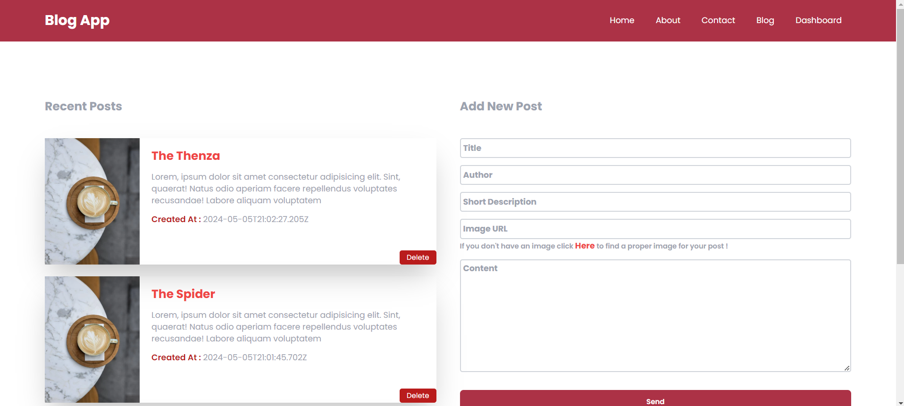

<a name="readme-top"></a>


# 📗 Table of Contents

- [📗 Table of Contents](#-table-of-contents)
- [📖 \[Blog App\] ](#-Blog_App-)
  - [🛠 Built With ](#-built-with-)
    - [Tech Stack ](#tech-stack-)
    - [Key Features ](#key-features-)
  - [💻 Getting Started ](#-getting-started-)
    - [Prerequisites](#prerequisites)
    - [Setup](#setup)
    - [Install](#install)
    - [Usage](#usage)
    - [Run tests](#run-tests)
  - [👥 Authors :  ](#-authors---)
  - [🔭 Future Features ](#-future-features-)
  - [🤝 Contributing ](#-contributing-)
  - [⭐️ Show your support ](#️-show-your-support-)
  - [🙏 Acknowledgments ](#-acknowledgments-)
  - [📝 License ](#-license-)

<!-- PROJECT DESCRIPTION -->

# 📖 Blog App <a name="about-project"></a>

- Our Blog Application is a modern platform for creating, managing, and sharing blog posts. Built with Node.js for the backend, vanilla JavaScript for the frontend, and styled with Tailwind CSS, it offers a clean and responsive user experience. Configuration management is handled securely with .env files. 👌💯


## 🛠 Built With <a name="built-with"></a>

### Tech Stack <a name="tech-stack"></a>


<details>
  <summary>Client</summary>
  <ul>
   <li>HTML</li>
    <li>CSS</li>
    <li>Tailwind CSS</li>
    <li>Vanilla JavaScript</li>
  </ul>
  <summary>Backend</summary>
  <ul>
   <li>Node Js</li>
    <li>Express</li>
    <li>Mongo DB</li>
  </ul>
</details>

### Key Features <a name="key-features"></a>


- [x] Follow best practices to enhance the code.⤵️
- [x] Refactor the code for applying clean code.😃
- [x] Users can write and publish new blog posts, Browse and read blog posts. ⤵👌💯
- [x] Remove blog posts and Display the last recent three posts. ⤵👌💯
- [x] Follow HTML, CSS, and JS best practices 😊


<p align="right">(<a href="#readme-top">back to top</a>)</p>


## 💻 Getting Started <a name="getting-started"></a>


To get a local copy up and running, follow these steps.

### Prerequisites

In order to run this project you need:


### Setup

Clone this repository to your desired folder:


```sh

  git clone https://gitlab.com/osamaashraf8/full-stack-blog-app.git
  
  cd full-stack-blog-app
```


### Install

Install this project with:
```sh
  cd  full-stack-blog-app
  npm install
```

### Usage

To run the project, execute the following command:

```sh
  - Open the IDE
  - Open the terminal and : 
                           - cd api 
                           - npm start
  - Open the project in the browser using live server                         
```


<p align="right">(<a href="#readme-top">back to top</a>)</p>

<!-- AUTHORS -->

## 👥 Authors <a name="authors"></a>

> Mention all of the collaborators of this project.

👤 **Author1**

- GitHub: [Osama Ashraf](https://github.com/osamaashraf6)
- Twitter: [Osama Ashraf](https://twitter.com/OsamaAshraf578?t=l75KjrhQgK4h-vSPfgk1gA&s=08)
- LinkedIn: [Osama Ashraf](https://www.linkedin.com/in/osamaashraf6/)

<p align="right">(<a href="#readme-top">back to top</a>)</p>


<!-- FUTURE FEATURES -->

## 🔭 Future Features <a name="future-features"></a>


- [x] Test the app using jest.⤵️
- [x] Use the webpack bundler to setup the project.😃
- [x] Deploy the app to let the users access/test it.⤵👌💯


<p align="right">(<a href="#readme-top">back to top</a>)</p>

<!-- CONTRIBUTING -->

## 🤝 Contributing <a name="contributing"></a>

Contributions, issues, and feature requests are welcome!

Feel free to check the [issues page](https://github.com/osamaashraf6/Blog-App-Node-and-Vanilla-JS/issues).

<p align="right">(<a href="#readme-top">back to top</a>)</p>

<!-- SUPPORT -->

## ⭐️ Show your support <a name="support"></a>

- If you like this project you can give me a star 😊 just to prove my app that it is useful for everyone and the users can benefit from it 💯.


<p align="right">(<a href="#readme-top">back to top</a>)</p>

<!-- ACKNOWLEDGEMENTS -->

## 🙏 Acknowledgments <a name="acknowledgements"></a>


I would like to thank all the contributors and code reviewers.

<p align="right">(<a href="#readme-top">back to top</a>)</p>


<!-- LICENSE -->

## 📝 License <a name="license"></a>

This project is MIT licensed.
